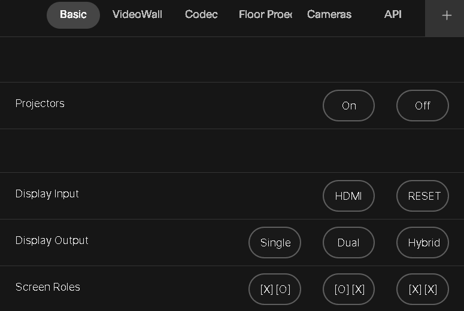

# 201 Presentation Space Control Macro for Cisco Devices

This macro provides an intuitive user interface (UI) panel to control various AV and presentation settings within a Cisco Room environment. It offers extensive functionality, such as projector control, screen role switching, input source management, presentation presets, and PoE (Power over Ethernet) cycling, all integrated into an easy-to-use panel accessible from the Home Screen.

## Features

- **Projector Control:** Turn projectors on and off, individually or in groups, for both wall and floor projectors.
- **Screen Role Management:** Easily toggle screen roles with predefined button options.
- **Input Source Control:** Seamlessly switch between different input sources, including HDMI, cameras, and PCs.
- **Presentation Presets:** Activate predefined layouts for various scenarios such as dual-screen Webex meetings, hybrid setups, or digital signage.
- **PoE Port Cycling:** Remotely cycle PoE ports using the integrated API commands, allowing quick resolution of connectivity issues.
- **API Integration:** Send system information and control commands via HTTP to external devices.
- **Mode Switching:** Switch between light and dark modes for the UI theme.

## How It Works

The macro is triggered by user interactions with the UI panel, which consists of buttons and widgets for specific actions. The macro listens for button presses and executes the corresponding commands, such as controlling projectors, cycling PoE ports, setting screen roles, or activating presets.

## UI Panel Structure

The user interface is organized into multiple pages:

1. **Basic Controls:**
    - **Projector On/Off**
    - **Display Input Source Selection**
    - **Display Output Views**
    - **Screen Role Options**

2. **Video Wall Presets:**
    - Preset options for Webex meetings, hybrid setups, and digital signage.

3. **Codec Control:**
    - Input source options for HDMI, cameras, and more.
    - Screen role management.

4. **Floor Projectors:**
    - Individual control for floor projectors.

5. **Cameras:**
    - Default camera view selection.

6. **API Control:**
    - **PoE Port Cycling:** Quickly power cycle a specified port on a network switch.
    - Power cycling and PC management via API.

## Integration of `poe-cycle.js`

The `poe-cycle.js` macro is integrated into the **API Control** page, where a button is provided to trigger the PoE port cycling function. This feature allows you to remotely reset devices that are connected to specific ports on a network switch, ensuring faster recovery from connectivity issues.

### PoE Cycle Button

- **Widget ID:** `poe-cycle`
- **Function:** Sends an HTTP request to a Flask API to cycle the specified PoE port on a Cisco Meraki switch.

## Usage

### Installation

1. Upload the provided `201-panel-ui.xml` file as a UI extension in the Cisco Room device’s settings.
2. Add the `201-panel.js` and `poe-cycle.js` files as macros in the Cisco Room device’s Macro Editor.
3. Activate both the UI panel and the macros.

### Configuring Devices

Ensure that the macros are configured with the correct IP addresses and HTTP endpoints for controlling external devices such as projectors, media players, and network switches.

### Operating the Macro

1. Access the **System Controls** panel from the Home Screen of the Touch 10 interface.
2. Use the available buttons to manage projectors, input sources, presentation presets, screen roles, and PoE port cycling.
3. The system will respond with feedback for each action, ensuring that the correct operations are performed.

### Customization

You can adjust the following configuration parameters in the `201-panel.js` and `poe-cycle.js` files:

- **Device URLs:** Update the IP addresses of your projectors, devices, and network switches.
- **API Server URL:** Set the `SERVER_URL` for API commands and system information.
- **Input Source IDs:** Customize input source IDs for your specific environment.
- **Presentation Presets:** Modify the preset numbers for custom video wall configurations.

## Example UI Layout

The UI panel provides easy navigation with clearly labeled buttons for each function. Below is a sample of the button layout:

The panel includes additional pages for more advanced controls such as codec inputs, floor projectors, and API commands.

## Notes

- Ensure that your network allows HTTP requests to external devices from the Cisco Room device.
- The macro is designed to handle both individual projector control and group actions for convenience.
- The UI is flexible and can be customized further if your environment requires additional controls or layout changes.

## Known Limitations

- The macro currently supports predefined device configurations. Additional devices may require code updates.
- Certain commands are dependent on the specific hardware and environment setup.
