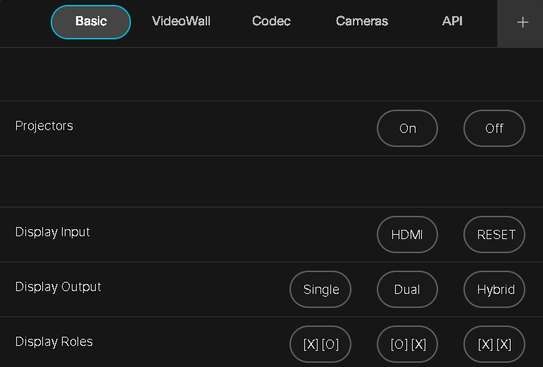

# 201C Presentation Space Control Macro for Cisco Devices

This macro provides a comprehensive user interface (UI) panel for controlling various AV and presentation settings within the Cisco Room environment of the 201C Presentation Space. The macro supports a range of functionalities, including projector control, screen role management, input source switching, presentation presets, and API integrations such as PoE port cycling.

## Features

- **Projector Control:** Easily manage the power states of projectors, both individually and in groups.
- **Screen Role Management:** Switch screen roles with simple button presses, ensuring the correct display configuration.
- **Input Source Control:** Seamlessly toggle between different input sources, including multiple PCs, HDMI inputs, and cameras.
- **Presentation Presets:** Activate predefined presentation layouts tailored for different meeting setups such as single-screen Webex, dual-screen Webex, hybrid Webex, and digital signage.
- **API Integration:** Use the panel to send system information and control commands via HTTP to external devices.
- **PoE Port Cycling:** Remotely power cycle specific ports on network switches through the integrated API, ensuring quick troubleshooting and recovery.
- **Camera Presets:** Quickly set camera views for different scenarios using predefined buttons.
- **Mode Switching:** Toggle between light and dark themes for the UI, enhancing usability based on room lighting.

## How It Works

The macro is designed to respond to user interactions on the UI panel. Button presses trigger corresponding actions such as switching input sources, recalling presets, controlling projectors, and sending HTTP commands to external devices. The macro leverages the Cisco xAPI to execute these commands and provide feedback to the user.

## UI Panel Structure

The UI is organized into several pages, each focusing on different control aspects of the presentation space:

1. **Basic Controls:**
    - **Projector On/Off**
    - **Display Input Source Selection**
    - **Display Output Views**
    - **Screen Role Options**

2. **VideoWall Presets:**
    - Preset buttons to quickly configure the video wall for various use cases, including single or dual codecs, and combinations with PCs.

3. **Codec Control:**
    - Manage input sources to the codec, including switching between PCs, HDMI, and cameras.
    - Reset the presentation to default Webex settings.

4. **Camera Presets:**
    - Buttons to quickly activate specific camera views, including options for the audience, video wall, and touch wall.

5. **API Control:**
    - **PoE Port Cycling:** A button to remotely power cycle a network switch port, ensuring connectivity restoration.
    - **PC Management:** Wake, reboot, or shut down connected PCs.

## Usage

### Installation

1. Upload the `201c-ui.xml` file as a UI extension to the Cisco Room device's settings.
2. Add the `201c-panel.js` macro to the Cisco Room device’s Macro Editor.
3. Ensure the macro and UI panel are both activated.

### Configuring Devices

- **Device URLs:** Modify the `DEVICE_URLS` array in the macro to reflect the correct IP addresses of the projectors and other controlled devices.
- **API Server URL:** Set the `SERVER_URL` for HTTP API commands and system information.
- **Presentation Presets:** Adjust the preset numbers in the macro to match your specific environment and configurations.

### Operating the Macro

1. Access the **System Controls** panel from the Home Screen of the Touch 10 interface.
2. Use the provided buttons to manage input sources, projector states, camera views, screen roles, and initiate API commands.
3. Feedback will be provided on the panel, confirming the success or failure of each action.

### Customization

- **Connector IDs:** Customize the connector IDs for input sources to match the specific setup in the room.
- **Preset Configurations:** Update or add new presets in the macro to cater to specific room layouts or meeting types.
- **API Integration:** Expand the API functionality by adding new HTTP commands or endpoints as needed.

## Example UI Layout

The UI is designed for ease of use, with a clear structure and logically grouped controls. Below is an example layout:

## Notes

- Ensure the network allows HTTP requests to external devices from the Cisco Room device.
- The UI panel is flexible and can be further customized if additional controls or layouts are required.
- Regularly update the macro and UI panel as needed to accommodate changes in room configuration or new device integrations.

## Known Limitations

- The macro is pre-configured for specific devices and scenarios. Additional devices may require further customization.
- Certain features depend on the specific hardware and network setup.
