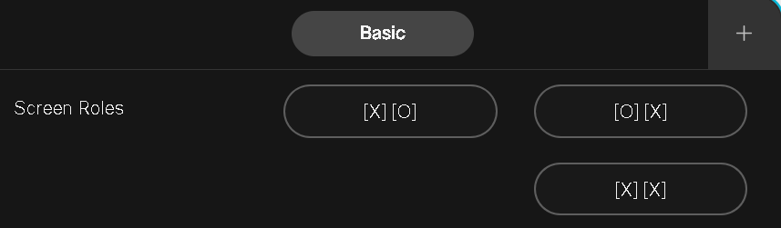

# 202 Optus 5G Boardroom Control Macro for Cisco Devices

This project provides a simple yet effective macro and UI panel for managing screen roles and content mirroring in the 202 Optus 5G Boardroom. The solution is designed for Cisco Room devices and allows for easy control over screen roles during meetings, ensuring that the display setup is always optimal.

## Features

- **Screen Role Management:** Switch between different screen roles to suit various meeting configurations.
- **Manual Role Switching:** Provides easy controls to flip screen roles or set both screens to show the same content.

## How It Works

The macro is designed to listen for button presses from the custom UI panel and then adjust screen roles accordingly. The controls are focused on providing quick access to flip screen roles or mirror content across both displays, making it ideal for different meeting setups.

## UI Panel Structure

The UI panel is minimal and focused, featuring only the essential controls:

1. **Screen Roles:**
    - **[X] [O]:** Sets the first screen as the primary and the second as secondary.
    - **[O] [X]:** Switches the roles of the screens.
    - **[X] [X]:** Mirrors the same content on both screens.

### Example UI Layout

The layout is designed to be simple and intuitive, making it easy for users to manage screen roles with just a few taps.

## Usage

### Installation

1. Upload the `panel-202-ui.xml` file as a UI extension in the Cisco Room device’s settings.
2. Add the `screen-roll-settings.js` file as a macro in the Cisco Room device’s Macro Editor.
3. Activate both the UI panel and the macro.

### Operating the Macro

1. Access the **controls** panel from the Home Screen of the Cisco Touch 10 interface.
2. Use the buttons provided to switch screen roles or mirror the screens.
3. The system will respond with the appropriate screen configuration based on your selection.

### Customization

You can adjust the following configurations:

- **Screen Role Assignments:** The predefined roles can be adjusted depending on how your screens are physically arranged.

## Notes

- Ensure that your network and room configuration support the HTTP requests made by the macro.
- The macro is designed to handle basic screen role setups and is optimized for simplicity.
