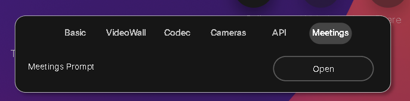

# Cisco Webex Room Devices - Meeting Deletion Macro with Password Protection

This macro provides a secure way to delete scheduled meetings from Cisco Webex Room Devices. Before deleting a meeting, the user must input a password to authorize the action.

## Features

- **Meeting Selection:** Displays a list of scheduled meetings for the user to select one to delete.
- **Password Protection:** Requires the user to enter an admin password before allowing the deletion of the selected meeting.
- **Confirmation Prompts:** After the password is successfully entered, the macro asks the user to confirm the deletion.
- **Decline Before Delete:** The meeting is first declined before deletion to properly handle Webex meeting invitations.
- **Automatic Verification:** After a meeting is deleted, the macro verifies that the deletion was successful.

## Installation

1. **Upload the Macro:**
   - Copy the JavaScript macro provided in this repository into your Webex Room Device via the Macro Editor.

2. **Add a Button Widget (Optional):**
   - Add a button to your UI panel in the Touch 10 interface or Navigator that triggers the macro. The widget should have the ID `startMeetingSelection`.

3. **Modify the Admin Password:**
   - Replace the `ADMIN_PASSWORD` constant in the macro with a secure password of your choice.

4. **Activate the Macro:**
   - Enable the macro in the Macro Editor.

5. **UI Panel Configuration:**
   - Ensure the UI panel in the Touch 10 or Webex Navigator device includes a button widget to start the meeting deletion process.

## Usage

1. **Starting the Process:**
   - The user presses the button on the UI panel (or the macro can be invoked manually through the Macro Editor).

2. **Meeting Selection:**
   - The macro retrieves all scheduled meetings and presents the user with a selection list.

3. **Password Input:**
   - After selecting a meeting, the user is prompted to enter the admin password to proceed with deletion.

4. **Confirmation Prompt:**
   - Once the correct password is entered, the user is asked to confirm the deletion of the selected meeting.

5. **Declining and Deleting the Meeting:**
   - The macro declines the meeting and then deletes it from the room system.

6. **Verification:**
   - After deletion, the macro verifies whether the meeting has been successfully removed.

## Configuration

### Admin Password

The admin password is stored in the following constant:

```javascript
const ADMIN_PASSWORD = 'admin';
```

Change the value to your desired password before deploying the macro. For enhanced security, consider encrypting or securely managing the password.

### UI Button Widget

Ensure you have a button widget in your device UI panel with the ID `startMeetingSelection`. This button triggers the meeting selection prompt when pressed. The widget can be created using the UI Extensions Editor.

### UI Screenshot


*Example of the UI panel with the 'Delete Meeting' button.*

## Code Explanation

- **`showMeetingSelectionPrompt()`**: Retrieves and displays the list of scheduled meetings on the device for the user to select one for deletion.
- **`requestPasswordForDeletion()`**: Prompts the user to enter the admin password before proceeding with deletion.
- **`showDeleteMeetingPrompt()`**: Confirms if the user wants to delete the selected meeting after entering the correct password.
- **`declineMeeting()`**: Declines the meeting invitation to properly handle Webex meetings.
- **`deleteMeeting()`**: Deletes the meeting from the room device using the meeting's `MeetingId`.
- **`verifyMeetingDeletion()`**: Ensures the meeting has been deleted by checking the current list of scheduled meetings.

## Security Considerations

- The admin password is stored as a plain string in the macro for simplicity. For production environments, consider using a more secure method for handling sensitive data.
- Only authorized users should have access to the interface to prevent unauthorized deletions.

## Troubleshooting

- **Failed Deletion:** If the deletion fails, the macro attempts up to three retries before giving an error message.
- **Incorrect Password:** If an incorrect password is entered, the user is notified, and the deletion is not performed.
- **No Meetings:** If there are no scheduled meetings, the macro will display an alert stating that no meetings are available.
