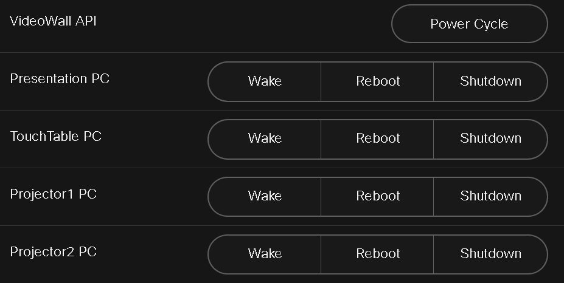

# Cisco Webex Device Macro: PoE Port Cycle and System Control

This macro provides control over PoE (Power over Ethernet) ports, ping testing, Wake-on-LAN (WoL), rebooting, and shutdown actions for various devices within a Cisco Room environment. It integrates with a Flask API backend to send commands that manage network devices, making it a versatile tool for IT and AV administrators.

## Features

- **Cycle PoE Ports:** Remotely toggle PoE ports to power cycle connected devices.
- **Ping Test:** Test the connectivity to a specified API endpoint.
- **Wake-on-LAN (WoL):** Send magic packets to wake up devices based on their MAC addresses.
- **Reboot and Shutdown Controls:** Remotely reboot or shut down devices in different rooms, providing centralized management.

## Usage Scenarios

This macro is designed to be used as part of a larger control interface for rooms like presentation spaces (e.g., Rooms 201 and 201C). It is typically integrated into a broader control panel but can also be implemented as a standalone control tool.

## How It Works

The macro listens for button presses from a Cisco Webex device's UI panel and sends HTTP requests to the configured API endpoints. It uses the following core features:

- **Flask API Integration:** Communicates with a backend API for PoE cycling, ping tests, and device management.
- **UI Widget Listeners:** Responds to widget actions and triggers corresponding functions like power cycling or WoL.
- **Alert Feedback:** Displays success or error messages on the Cisco Webex device when actions are completed.

## Configuration

1. **API URLs:** Update the `flaskApiUrl`, `pingUrl`, and other endpoint URLs as needed in the `poe-cycle.js` file.
2. **Device MAC Addresses:** Add or update MAC addresses for devices in the corresponding functions (e.g., `sendWakeOnLan`).
3. **Room and Host Codes:** Modify the room and host codes in the reboot and shutdown functions for your environment.

## Example Workflow

1. **Cycle PoE Port:**
   - When the "PoE Cycle" button is pressed on the UI panel, the macro sends a POST request to the configured Flask API endpoint to cycle the specified port.

2. **Ping Test:**
   - The "Ping Test" button triggers a GET request to test connectivity with the API.

3. **Wake-on-LAN:**
   - Select a device from the panel and send a WoL packet based on its MAC address.

4. **Reboot/Shutdown:**
   - Reboot or shut down specified devices from the control panel.

## Integration with Control Panel

While this macro can be used independently, it is intended to be part of a comprehensive AV control interface. Below is an overview of how it integrates with the larger control UI:

- **Projector Control:** Control wall and floor projectors.
- **Presentation Management:** Manage input sources and video wall presets.
- **Device Management:** Wake, reboot, and shut down various devices within the presentation rooms.

## Example UI Panel (Demo)

If you want to create a standalone demo panel for this macro, the following XML configuration can be used:

```xml
<Extensions>
  <Version>1.11</Version>
  <Panel>
    <Order>1</Order>
    <PanelId>poe_control_panel</PanelId>
    <Origin>local</Origin>
    <Location>HomeScreen</Location>
    <Icon>Lightbulb</Icon>
    <Color>#D43B52</Color>
    <Name>PoE Control Panel</Name>
    <ActivityType>Custom</ActivityType>
    <Page>
      <Name>Control Actions</Name>
      <Row>
        <Name>PoE Port Control</Name>
        <Widget>
          <WidgetId>poe-cycle</WidgetId>
          <Name>Cycle PoE Port</Name>
          <Type>Button</Type>
          <Options>size=2</Options>
        </Widget>
      </Row>
      <Row>
        <Name>Ping Test</Name>
        <Widget>
          <WidgetId>ping-test</WidgetId>
          <Name>Run Ping Test</Name>
          <Type>Button</Type>
          <Options>size=2</Options>
        </Widget>
      </Row>
      <Row>
        <Name>Wake-on-LAN</Name>
        <Widget>
          <WidgetId>wake-presentationPC</WidgetId>
          <Name>Wake Presentation PC</Name>
          <Type>Button</Type>
          <Options>size=2</Options>
        </Widget>
        <Widget>
          <WidgetId>wake-touchtablePC</WidgetId>
          <Name>Wake TouchTable PC</Name>
          <Type>Button</Type>
          <Options>size=2</Options>
        </Widget>
      </Row>
      <Options/>
    </Page>
  </Panel>
</Extensions>
```

## UI Preview



## Installation

1. Upload the macro script `poe-cycle.js` to your Cisco Room device via the Macro Editor.
2. Optionally, create a UI panel using the demo XML above or integrate the macro into an existing control panel.
