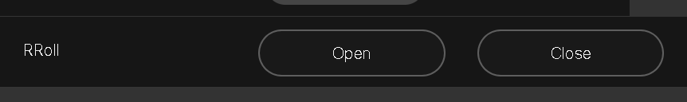

Here’s the `README.md` for your Rick Roll macro:

---

# Rick Roll Macro for Cisco Devices

This script allows you to Rick Roll your audience by opening a WebView displaying the classic "Never Gonna Give You Up" music video by Rick Astley. The macro provides two main functionalities: opening and closing the WebView for the YouTube video.

## Features
- **Open the Rick Roll Video:** Automatically launches the YouTube video in a WebView on your Cisco device.
- **Close the WebView:** Closes the WebView when the content is no longer needed.

## Requirements
- Cisco Room device with WebView capability.
- Buttons configured in the user interface (UI) for triggering the open and close actions.

## UI Setup
The interface includes two buttons:
1. **Open Rick Roll Video:** Triggers the `open_rick_roll` widget.
2. **Close Rick Roll Video:** Triggers the `close_rick_roll` widget.

You can refer to the UI screenshot below to see how the buttons are laid out:

### Widget IDs:
- **`open_rick_roll`:** Opens the YouTube video.
- **`close_rick_roll`:** Closes the WebView.

## How It Works
The macro listens for button click events in the UI. When the `open_rick_roll` button is pressed, the script launches the Rick Astley video in the WebView. When the `close_rick_roll` button is pressed, the WebView is cleared and closed.

### How to Use:
1. Add the provided script to your Cisco Room device’s macros.
2. Configure the UI with buttons linked to the widget IDs mentioned above.
3. Run the macro, and enjoy surprising your audience with the Rick Roll video.

### Notes:
- Ensure that the WebView feature is enabled and supported on your Cisco device.
- The script is designed to be lightweight and focuses on the simplicity of opening and closing the video.

---

This README provides a clear overview of how to set up and use the Rick Roll macro on Cisco devices.
